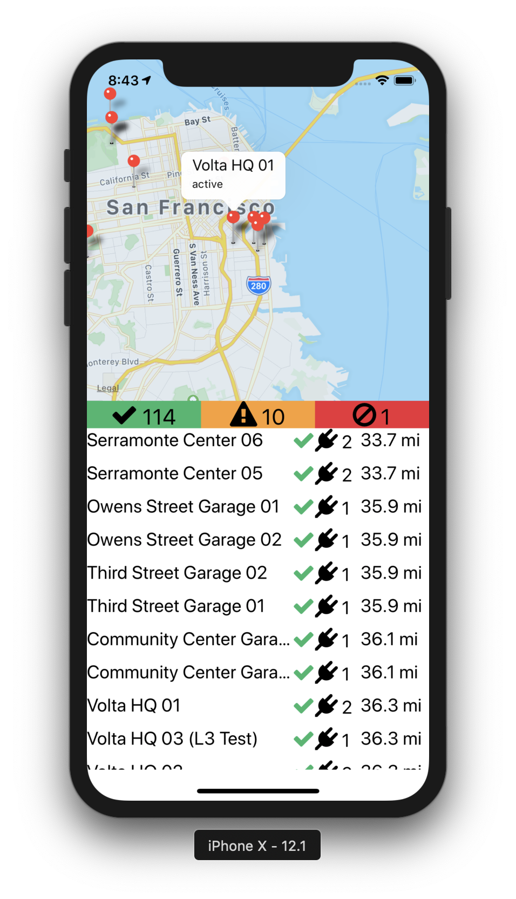

# Intro


The goal of this application is to give users an high level overview of volta charging stations near their current location. The app aggregates the total number of active, under construction, needs service, and decommissioned stations in a 50 mile radius. Tapping on a station results in the map moving to the location of the station.

# How to install and run

```
git clone https://github.com/pbrogan12/volta-data-challange.git
cd volta_data_challange
npm install
react-native link
react-native run-{ios,android} # pick ios or android
```

# Libraries

- [react-navigation](https://github.com/react-navigation/react-navigation)
- [react-native-vector-icons](https://github.com/oblador/react-native-vector-icons)
- [react-native-maps](https://github.com/react-native-community/react-native-maps)
- [geolib](https://github.com/manuelbieh/Geolib)
- [geopoint](https://github.com/perfectline/geopoint)
